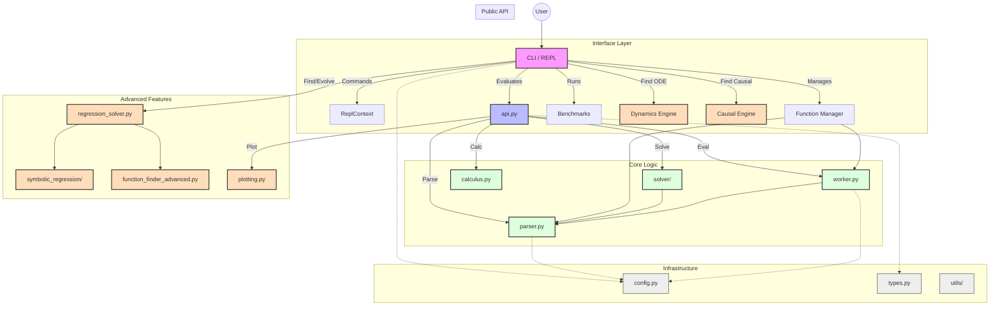

# Kalkulator AI Codebase Map

This document provides a comprehensive overview of the `kalkulator-ai` system, including every file in the package.

---

## Part 1: System Architecture Overview

### High-Level Architecture

The system is designed with a layered architecture:

1.  **Interface Layer (`cli/`)**: The central hub. It parses user input and routes it to the appropriate engine (Equations, Functions, Dynamics, or Causal).
2.  **API Layer (`api.py`)**: A stable public API that exposes core capabilities to the CLI and external consumers.
3.  **Core Logic Layer**:
    - **Parsing (`parser.py`)**: Preprocesses and parses mathematical expressions strings into SymPy objects.
    - **Solving (`solver/`)**: Contains logic for solving equations, inequalities, and systems.
    - **Function Management (`function_manager.py`)**: Handles user-defined functions, persistence, and function finding.
    - **Execution (`worker.py`)**: Safely evaluates expressions, potentially in isolated processes.
4.  **Advanced Features (The Engines)**:
    - **Symbolic Regression (`regression_solver.py`, `symbolic_regression/`)**: Discovers formulas from data (e.g., `y = x^2`).
    - **Dynamics Discovery (`dynamics_discovery/`)**: Discovers differential equations from time-series data using SINDy (e.g., `dx/dt = sigma*(y-x)`).
    - **Causal Discovery (`causal_discovery/`)**: Infers cause-and-effect graphs from data using the PC Algorithm (e.g., `A -> B`).
    - **Calculus (`calculus.py`)**: Differentiation and integration logic.

### Component Diagram

---

## Part 2: Comprehensive File Inventory

This section lists **every single file** in the codebase, organized by directory.

### Root Directory (`/`)

| File                | Description                                                                                            |
| :------------------ | :----------------------------------------------------------------------------------------------------- |
| **`kalkulator.py`** | **Entry Wrapper.** Thin wrapper script to run the application (calls `kalkulator_pkg.cli.main_entry`). |

### Package Root (`kalkulator_pkg/`)

| File                              | Description                                                                                   |
| :-------------------------------- | :-------------------------------------------------------------------------------------------- |
| **`__init__.py`**                 | Package init. Imports core modules to expose package-level API.                               |
| **`__main__.py`**                 | Module entry point (`python -m kalkulator_pkg`).                                              |
| **`abpn.py`**                     | _(Empty File)_ Placeholder/abandoned.                                                         |
| **`api.py`**                      | **Public API.** The central gateway for programmatic control.                                 |
| **`cache_manager.py`**            | **Persistence.** Saves/loads computation cache (JSON/Pickle).                                 |
| **`calculus.py`**                 | **Math.** Differentiation and integration logic.                                              |
| **`config.py`**                   | **Config.** Global constants (timeouts, limits, patterns).                                    |
| **`function_finder_advanced.py`** | **Discovery.** Logic for feature generation and model selection. Used by `regression_solver`. |
| **`function_manager.py`**         | **Registry.** Manages user-defined functions and finding requests.                            |
| **`logging_config.py`**           | **Logging.** Setup for application-wide logging.                                              |
| **`parser.py`**                   | **Core.** String preprocessing and SymPy parsing.                                             |
| **`plotting.py`**                 | **Vis.** Function plotting using `matplotlib`.                                                |
| **`regression_solver.py`**        | **Discovery.** Main logic for "Find Function" feature. Uses `symbolic_regression`.            |
| **`types.py`**                    | **Types.** shared `dataclasses` (e.g., `EvalResult`, `SolveResult`).                          |
| **`worker.py`**                   | **Safety.** Execution engine for safe/sandboxed evaluation.                                   |

### CLI Subdirectory (`kalkulator_pkg/cli/`)

| File                    | Description                                                                                                          |
| :---------------------- | :------------------------------------------------------------------------------------------------------------------- |
| **`__init__.py`**       | Exposes `main_entry`.                                                                                                |
| **`__main__.py`**       | CLI execution entry point.                                                                                           |
| **`app.py`**            | **Main Driver.** The top-level run loop. **Directly imports and controls** `SINDy`, `PCAlgorithm`, and `Benchmarks`. |
| **`context.py`**        | **State.** definitions for holding the REPL session state.                                                           |
| **`repl_commands.py`**  | **Commands.** Standard commands (`help`, `clear`).                                                                   |
| **`repl_core.py`**      | **Loop.** The core Read-Eval-Print logic.                                                                            |
| **`commands/`**         | _Modular command extensions._                                                                                        |
| **`commands/debug.py`** | Debug utilities (`debug` command).                                                                                   |

### Solver Subdirectory (`kalkulator_pkg/solver/`)

| File                | Description                                                    |
| :------------------ | :------------------------------------------------------------- |
| **`__init__.py`**   | Exposes public solver functions.                               |
| **`dispatch.py`**   | **Router.** Analyzing input to pick the right solver strategy. |
| **`algebraic.py`**  | **Polynomials.** (`x^2=4`).                                    |
| **`inequality.py`** | **Inequalities.** (`x > 5`).                                   |
| **`system.py`**     | **Systems.** (`x+y=1, x-y=2`).                                 |
| **`modular.py`**    | **Modular.** (`x = 2 mod 5`).                                  |
| **`inverse.py`**    | **Inversion.** Finds inverse functions.                        |
| **`numeric.py`**    | **Fallback.** Numeric solving if symbolic fails.               |
| **`utils.py`**      | **Helper.** Math utilities for solvers.                        |

### Symbolic Regression (`kalkulator_pkg/symbolic_regression/`)

| File                     | Description                                                   |
| :----------------------- | :------------------------------------------------------------ |
| **`__init__.py`**        | Exposes genetic engine.                                       |
| **`genetic_engine.py`**  | **Algorithm.** Main evolution loop for discovering equations. |
| **`expression_tree.py`** | **Structure.** Tree representation of mathematical formulas.  |
| **`operators.py`**       | **Genetics.** Mutation and crossover implementation.          |
| **`pareto_front.py`**    | **Selection.** Manages best candidate solutions.              |

### Specialized Engines (Advanced Features)

#### Dynamics Discovery (`kalkulator_pkg/dynamics_discovery/`)

_Used by `cli/app.py` for the `find ode` command._
| File | Description |
| :--- | :--- |
| **`sindy.py`** | **SINDy Engine.** Sparse Identification of Nonlinear Dynamics. |
| **`derivative_estimation.py`** | **Math.** Estimating derivatives from numerical data. |

#### Causal Discovery (`kalkulator_pkg/causal_discovery/`)

_Used by `cli/app.py` for the `find causal` command._
| File | Description |
| :--- | :--- |
| **`pc_algorithm.py`** | **Causal Engine.** Implements the PC Algorithm for graph discovery. |

#### Benchmarks (`kalkulator_pkg/benchmarks/`)

_Used by `cli/app.py` for the `benchmark` command._
| File | Description |
| :--- | :--- |
| **`benchmark_runner.py`** | **Runner.** Executes specific function-finding tests. |
| **`feynman_equations.py`** | **Dataset.** Feynman physics equations for validation. |

#### Dimensional Analysis (`kalkulator_pkg/dimensional_analysis/`)

_Used by `cli/app.py` (indirectly via `units` command)._
| File | Description |
| :--- | :--- |
| **`units.py`** | **Physics.** Unit consistency and dimensional group finding. |

#### Noise Handling (`kalkulator_pkg/noise_handling/`)

_Used by `regression_solver.py` for robust fitting._
| File | Description |
| :--- | :--- |
| **`robust_regression.py`** | **Stats.** RANSAC/Huber regression to handle outliers. |
| **`uncertainty.py`** | **Stats.** Confidence interval estimation. |

#### Utilities (`kalkulator_pkg/utils/`)

| File                      | Description                                     |
| :------------------------ | :---------------------------------------------- |
| **`formatting.py`**       | Pretty-printing (superscripts, colored output). |
| **`numeric.py`**          | Numeric helpers (GCD, float conversion).        |
| **`custom_functions.py`** | Definitions for non-standard functions.         |
