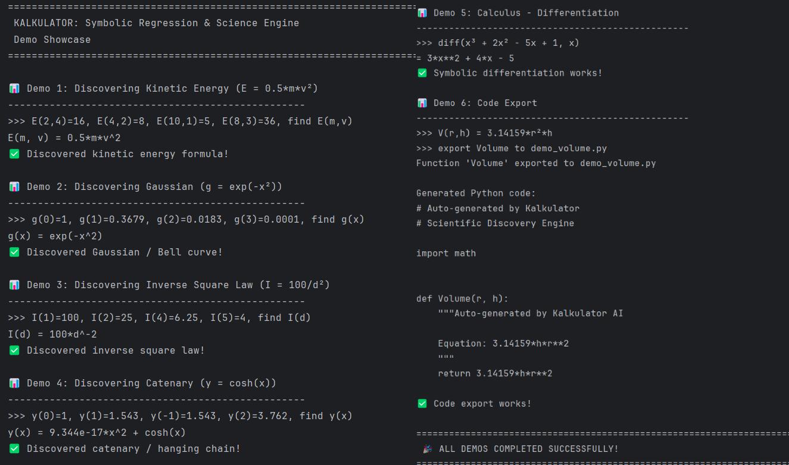

# Kalkulator-ai CLI


**Research-grade CLI for Symbolic Regression.** Discovers mathematical formulas, ODEs, and causal relationships from data directly in your terminal.

## Capabilities

- **Symbolic Regression**: Identifies exact equations (`y = 5*x^2`) from raw data.
- **Physics Discovery**: Patterns include inverse square laws, exp/log, and trigonometric series.
- **SINDy**: Discovers differential equations (`dx/dt`) from time-series.
- **Genetic Programming**: Evolves complex functional forms via mutation/crossover.
- **Calculus**: Symbolic differentiation (`diff`) and integration (`integrate`).
- **Agentic Discovery**: Intelligent feature selection logic.

## 🏆 Trophy Case: Solved Functions

These demonstrate Kalkulator's ability to discover functions that defeat standard regression engines:

| Function                | Description             | Why It's Hard                                       |
| ----------------------- | ----------------------- | --------------------------------------------------- |
| `floor(x) + frac(x)²`   | The Scalloped Staircase | Cusps at every integer break gradient-based solvers |
| `x ⊕ 5`                 | Bitwise XOR             | Non-continuous, digital logic                       |
| `Fibonacci(n)`          | Golden Ratio Sequence   | Detects recurrence, seeds Binet formula             |
| `Tribonacci(n)`         | 3-term Recurrence       | Auto-detects `f(n)=f(n-1)+f(n-2)+f(n-3)`            |
| `x % 1.5`               | Sawtooth Modulo         | Periodic zeros detection                            |
| `acosh(x)`              | Complex Domain          | Requires forensic detection of hyperbolic patterns  |
| `π(x)`                  | Prime Counting          | Integer-only step function                          |
| `x^x`                   | Self-Power              | Complex logarithmic domain                          |
| `(x+1)^(1/x)`           | Constant Anchor         | Detected via `f(2) = √3` pattern                    |
| `dy/dt = 2y(1-y)`       | Logistic ODE            | Phase space regression (y' vs y)                    |
| `\|sin(x)\|`            | Bouncing Ball           | Cusp detector finds V-shaped zeros                  |
| `min(x, 5)`             | Clamped Linear          | Clamp detector (linear then constant)               |
| `Heaviside(x-3)-H(x-7)` | Rectangle Pulse         | Pulse detector finds rising/falling edges           |
| `max(0, x)`             | ReLU                    | Piecewise linear detector                           |

## Installation

Requires Python 3.8+.

```bash
git clone https://github.com/sizzlins/kalkulator-ai
pip install -r requirements.txt

# Optional: For Excel/Parquet support
pip install pandas openpyxl
```

## Usage

Legacy CLI:

```bash
python kalkulator.py
```

Or

Download the .exe file, kalkulator.exe
https://github.com/sizzlins/kalkulator-ai/blob/main/kalkulator.exe

### Commands

- `f(x)=...`: Define function.
- `find f(x)`: Discover function from data.
- `evolve ...`: Genetic programming search.
  - `--boost N`: N× resources (population, generations, timeout).
  - `from file.csv`: Load data from CSV.
  - `--verbose`: Show progress.
  - `--hybrid`: Seed with find() result.
- **Shortcuts** (common evolve combinations):
  - `alt f(...)`: **ULTIMATE** (`--hybrid --verbose --boost 3 --transform`)
  - `all f(...)`: Full power (`--hybrid --verbose --boost 3`)
  - `b f(...)`: Fast mode (`--verbose --boost 3`)
  - `h f(...)`: Smart mode (`--hybrid --verbose`)
  - `v f(...)`: Verbose (`--verbose`)
  - `ode f(...)`: **ODE Discovery** - finds differential equations like `y'' + y = 0`
- `diff(...)`: Differentiate.
- `integrate(...)`: Integrate.
- `save/load`: Persist state.

### Examples

**Physics (Kinetic Energy)**

```
>>> alt E(2,4)=16, E(4,2)=8, E(10,1)=5, E(2,2)=4, find E(m,v)
Result: m*v^2/2
MSE: 0, Complexity: 7.0
```

> ⚠️ Note: 4 points needed - 3 points define a plane (linear fit).

**LambertW (Inverse x^x)**

```
>>> f(4)=2, f(27)=3, f(256)=4, find f(x)
Discovered: f(x) = exp(LambertW(log(x)))
```

**Exponential Decay** (requires 3+ points)

```
>>> alt g(0)=1, g(1)=0.3679, g(2)=0.1353, find g(x)
Result: exp(-x)
MSE: 5.56e-10, Complexity: 4.0
```

> ⚠️ Note: 2 points = line. 3+ points force the curve.

**Bitwise Logic**

```
>>> f(0)=5, f(1)=4, f(2)=7, f(3)=6
Result: bitwise_xor(x, 5)
```

**Fibonacci Sequence** (with Golden Ratio)

```
>>> alt f(0)=0, f(1)=1, f(2)=1, f(3)=2, f(4)=3, f(5)=5, f(6)=8, f(7)=13
Forensic Analysis: Linear Recurrence detected
   → f(n) = f(n-1) + f(n-2) confirmed for 6 points
   → Matches Fibonacci sequence
Result: (-1/sqrt(5))*((1 - sqrt(5))/2)^x + (1/sqrt(5))*((1 + sqrt(5))/2)^x
MSE: 2.82e-29 ← Binet's Formula!
```

**Complex Transcendental** (with `alt` - intelligent discovery)

```
>>> alt f(1)=2, f(2)=1.732, f(3)=1.587, f(4)=1.495
Detected 1 constant anchor(s):
   f(2) = sqrt(3) ≈ 1.732051
   Generated 3 hypothesis expression(s)
     • (x+1)**(1/x)
     ...
Generation 0: Best MSE 7.71e-30 ((x + 1)**(1/x))
Result: (x + 1)^(1/x)
MSE: 8.08e-30  ← PERFECT!
```

### Best Practices for Data Input

> [!WARNING] > **Common Misconception: "More Data = Better Discovery"**
>
> Unlike training an LLM (where more diverse data = broader knowledge), symbolic regression finds **ONE specific function** from its output. This is fundamentally different:
>
> | Task                                       | Data Strategy              |
> | ------------------------------------------ | -------------------------- |
> | **LLM Training:** Learn many topics        | More books = better ✅     |
> | **Symbolic Regression:** Find one equation | Cleaner signal = better ✅ |
>
> **Think of it like:**
>
> - **LLM:** Building a library → need cookbooks, car manuals, history books, etc.
> - **Symbolic Regression:** Solving a single puzzle → need clear, consistent pieces
>
> **Real Example:**
>
> - ⚠️ 148 points with extreme values (10^-25 to 10^23) → **Works, but slow** (Generation 5, MSE 4.6e-05)
> - ✅ 6 clean points (1 to 100 range) → **Found `x^y` instantly** in Generation 0 (MSE 0.0)
>
> Adding more data doesn't teach the algorithm about "different functions"—it just adds more measurements of the **same function**. Clean, strategic data is faster and more accurate.

> **Key Insight:** Quality > Quantity. Strategic, well-behaved data enables faster, more accurate discovery than large datasets with extreme values.

#### General Principles

| Characteristic   | ✅ Good                     | ❌ Bad                                              |
| ---------------- | --------------------------- | --------------------------------------------------- |
| **Sample Count** | 8-25 strategic points       | 100+ redundant points or <5 sparse points           |
| **Output Range** | 2-4 orders of magnitude     | >10 orders of magnitude (e.g., 0.0001 to 1,000,000) |
| **Distribution** | Evenly spaced in domain     | Clustered or completely random                      |
| **Input Values** | Simple integers/fractions   | Only edge cases or special values                   |
| **Noise**        | Clean or consistently noisy | Mixed infinities/NaN/complex values                 |

#### Why Data Quality Still Matters

**Example: Wide Range Data (148 points)**

```
>>> f(x,y)=x^y
>>> f(-5,-5), f(-5,-4), ..., f(5,5), f(-20,-19), ..., f(20,e), f(pi,i), ...
Data skew detected (ratio 708235345355338032349184.0). Using scale-invariant fitness.
  → Algorithm will discover functions in original form
Result: x**y  # ✅ Finds it correctly with scale-invariant fitness!
MSE: 4.60e-05
```

**However**, cleaner data is still better:

**Example: Clean Data (6 points)**

```
>>> evolve f(2,2)=4, f(2,3)=8, f(3,2)=9, f(4,2)=16, f(2,0)=1, f(10,2)=100
Generation 0: Best MSE 0.00e+00 (x**y)  # ✅ Found INSTANTLY!
Result: x^y
MSE: 0.0
```

**Key Difference:**

- **148 points** (wide range): Works, but takes longer (Generation 5, MSE 4.60e-05)
- **6 points** (clean): Instant discovery (Generation 0, MSE 0.0)

**Takeaway:** While Kalkulator can now handle extreme data ranges, providing clean, strategic data is still faster and more accurate.

#### Function-Specific Guidelines

**Power Functions:** `f(x,y) = x^y`

```
f(2,2)=4, f(2,3)=8, f(3,2)=9, f(4,2)=16, f(2,0)=1, f(10,2)=100
```

↳ _6-10 points, positive bases, small exponents_

**Polynomials:** `f(x) = ax² + bx + c`

```
f(-2)=-3, f(-1)=0, f(0)=1, f(1)=0, f(2)=-3
```

↳ _5-7 points, symmetric around zero, include vertex_

**Trigonometric:** `f(x) = A·sin(Bx + C)`

```
f(0)=0, f(π/4)=0.707, f(π/2)=1, f(3π/4)=0.707, f(π)=0, f(3π/2)=-1
```

↳ _Cover one full period, include zeros/peaks_

**Exponential:** `f(x) = A·e^(Bx)`

```
f(0)=1, f(1)=2.718, f(2)=7.389, f(3)=20.085
```

↳ _Linear spacing in domain, watch for explosion_

**Rational:** `f(x) = (ax+b)/(cx+d)`

```
f(-10)=1.2, f(-2)=4, f(-1)=∞, f(0)=-2, f(1)=-0.67, f(10)=0.82
```

↳ _Include points near asymptotes, but not exactly at them_

#### The "Goldilocks Zone"

| Points    | Effect               | Use Case                                                        |
| --------- | -------------------- | --------------------------------------------------------------- |
| **< 6**   | Underconstrained     | Multiple functions fit; ambiguous                               |
| **8-25**  | ✅ Optimal           | Fast, stable, clear pattern                                     |
| **30-50** | Acceptable           | Slightly slower, may introduce noise                            |
| **> 100** | ❌ Counterproductive | Numerical instability, pattern dilution, computational overhead |

#### Quick Checklist

Before running `find` or `evolve`:

1. ✅ Do output values stay within 3-4 orders of magnitude?
2. ✅ Are inputs evenly distributed across the domain?
3. ✅ Do you have 8-20 data points?
4. ✅ Did you include critical points (zeros, peaks, inflections)?
5. ✅ Are all values real numbers (no complex/infinite)?

If you answered **yes** to all, you're ready for accurate discovery!

> [!NOTE] > **Technical Detail: How Kalkulator Handles Wide-Range Data**
>
> When data spans many orders of magnitude (e.g., 1e-25 to 1e23), Kalkulator automatically uses **scale-invariant fitness** instead of transforming your data. This allows the genetic algorithm to discover functions in their original form (e.g., `x^y` not `y*log(x)`).
>
> You'll see this message:
>
> ```
> Data skew detected (ratio 100000000000.0). Using scale-invariant fitness.
>   → Algorithm will discover functions in original form
> ```
>
> This is a **feature**, not a warning - it means the algorithm is being smart!

### Advanced Data Input

**File Import (CSV)**

```bash
>>> evolve f(x) from data.csv
Loaded 2 variables from 'data.csv': ['x', 'y']
```

**Explicit Target Syntax**

```bash
>>> evolve y = f(x) from x=[1,2,3], y=[3,5,7]
Discovered: 2*x + 1
```

**Boosting Mode (Hard Problems)**

```bash
>>> evolve --boost f(x) ...
Boost mode: 5x resources
```

### Calculus

**Differentiation**
Syntax: `diff(expression, variable)`

- **Why the variable?** In multi-variable calculus, you must specify which variable changes.
  - `diff(x*y, x)` -> `y` (Slope with respect to x)
  - `diff(x*y, y)` -> `x` (Slope with respect to y)

```
>>> diff(log(x), x)
Result: diff(log(x), x) = 1/x
```

## Limitations

### Function Types

Function finding discovers **continuous mathematical relationships**. The following are **not auto-discoverable**:

| Type                 | Examples                        | Reason                    |
| -------------------- | ------------------------------- | ------------------------- |
| Combinatorial        | `factorial(x)`, `binomial(n,k)` | Integer-only, huge growth |
| Arbitrary Recurrence | Ackermann, custom recursions    | No general closed-form    |

**Note:** As of v1.4.0, **Bitwise Logic** (`^`, `&`, `|`, `<<`, `>>`) and **Prime Counting** (`prime_pi`) ARE supported! Also `abs(x)` is fully supported.

**NEW in v1.4.1:**

- **Fibonacci/Tribonacci/Tetranacci** sequences are auto-detected via recurrence analysis and solved with Binet's formula
- **Modulo patterns** (`x % T`) detected via periodic zero analysis
- **Symbolic constant recognition** converts ugly decimals like `0.4472...` to `1/sqrt(5)`
- **Lambdify caching** provides 5-10x speedup for repeated evaluations

**Workaround:** Define manually: `f(x)=x!`

### When to Use `find` vs `evolve`

| Use Case                    | Recommended | Why                              |
| --------------------------- | ----------- | -------------------------------- |
| Clean data, known patterns  | `find`      | Exact regression is reliable     |
| Exponential (`2^x`, `e^x`)  | `find`      | Has explicit `exp(a*x)` template |
| Pole functions (`x/(x-1)²`) | `find`      | Auto-detects poles from inf/nan  |
| Noisy/complex data          | `evolve`    | Exploratory, tolerates noise     |
| Novel function forms        | `evolve`    | Searches without assumptions     |

**Tips:**

- Use `find` first for most cases - it's faster and more reliable
- `evolve` auto-seeds with detected patterns (poles, frequencies) for better results
- If `find` gives low confidence, try `evolve` for exploration

### Data Types

**NEW in v1.4+**: Complex-valued data is fully supported! The genetic engine handles complex inputs/outputs.

```
>>> alt f(i)=1+2i, f(2i)=3+4i, find f(x)
Result: discovered complex function
```

Complex numbers are preserved through evolution - no filtering required.

### Numerical Limits & Precision

**Floating Point Limits (Machine Epsilon):**
Standard 64-bit floating point math breaks down when values differ by more than 15 decimal places ("Catastrophic Cancellation").

**Example:** `f(x) = (1+x)^(1/x)` (approaches `e` as x→0).

- `f(1e-10) ≈ 2.718` (Correct)
- `f(1e-16)` → `1.0` (Incorrect)

**Why**: `1.0 + 1e-16` is exactly `1.0` in computer memory. Then `1.0^Huge` is `1.0`. The tiny `x` information is lost before the exponentiation happens.

**High-Power Polynomials:**
Polynomials (`x^10`, `x^11`)...

- `find` works for `x^10` but may struggle with `x^11` and above (values exceed 10^11)
- `evolve` finds approximate exponents (e.g., `x^10.16` instead of `x^10`)

**Workaround:** Use `find` for high-power polynomials with moderate data ranges.

### Composite Functions

Deeply nested composite functions are beyond algorithm scope:

| Pattern               | Example        | Why                            |
| --------------------- | -------------- | ------------------------------ |
| Trig of rational      | `sin(1/(x-3))` | Infinite nesting possibilities |
| Nested transcendental | `sin(cos(x))`  | Combinatorial search space     |

**Workaround:** Define manually: `f(x)=sin(cos(tan(x)))`

### Complex Rational Functions

Multi-pole rational functions with polynomial numerators/denominators:

| Pattern         | Example         | Why                          |
| --------------- | --------------- | ---------------------------- |
| Quadratic ratio | `(1+x²)/(1-x²)` | Multiple poles, complex form |
| Higher-order    | `(x³+1)/(x³-1)` | No general templates         |

**Workaround:** Define manually: `f(x)=(1+x^2)/(1-x^2)`

### Square Root Functions

Nested radical functions involving squares:

| Pattern      | Example           | Why                     |
| ------------ | ----------------- | ----------------------- |
| Sqrt of quad | `sqrt(x²-16)`     | No sqrt(poly) templates |
| Nested sqrt  | `sqrt(x+sqrt(x))` | Infinite nesting        |

**Workaround:** Define manually: `f(x)=sqrt(x^2-16)`

### High-Degree Polynomials

Polynomials beyond degree 5:

| Pattern           | Example     | Why                                     |
| ----------------- | ----------- | --------------------------------------- |
| Degree 6+         | `x^6 + x^5` | Too complex for GP; Polyfit handles 3-5 |
| High coefficients | `100x⁶`     | Large search space                      |

**Workaround:** Define manually: `f(x)=3x^6-5x^3`

## Advanced: External Tools

For complex functions our algorithms can't discover (e.g., `sqrt(x²-16)`), consider using **PySR** externally:

```bash
pip install pysr  # Requires Julia (~500MB download)
```

```python
from pysr import PySRRegressor
import numpy as np

X = np.array([[4],[5],[6],[7],[8]])
y = np.array([0, 3, 4.47, 5.74, 6.93])

model = PySRRegressor(
    binary_operators=["+", "-", "*", "/"],
    unary_operators=["sqrt", "sin", "cos"],
)
model.fit(X, y)
print(model)  # Shows discovered equations
```

> **Note:** PySR is a separate project. First run downloads Julia and takes 1-2 minutes.

## Floating-Point Precision Limitations

⚠️ **Important:** Kalkulator uses standard IEEE 754 double-precision floating-point arithmetic, which has **~15-17 decimal digits of precision**.

### What This Means

Values beyond this precision are **automatically rounded**:

```
>>> 1.000000000000000000000000000000000000000001
Result: 1

>>> 1 = 0.9999999999999999999999999999999999999999999
Result: Identity  # Both round to exactly 1.0
```

This is **not a bug** - it's a fundamental limitation of how computers represent real numbers. The extra digits beyond position 15-17 are lost during parsing.

### When This Matters

- **Cryptography**: Use arbitrary-precision libraries (`decimal.Decimal`, SymPy `Rational`)
- **Financial calculations**: Consider using integer cents instead of fractional dollars
- **Exact symbolic math**: Define expressions symbolically (e.g., `1/3` not `0.333333...`)

### When It Doesn't Matter

- **Scientific calculations**: 15 digits is sufficient for most physics/engineering
- **Data analysis**: Machine learning models don't need beyond double precision
- **Everyday math**: Calculator-style operations

For true arbitrary precision, consider using SymPy's `Rational` or Python's `decimal.Decimal` module directly.

## Architecture

- **Core**: `kalkulator_pkg`
- **Solvers**: Hybrid Sparse Regression (Lasso/OMP) + Genetic Programming + SINDy.
- **Safety**: Bounded execution, sandboxed evaluation.

## License

MIT License

Copyright (c) 2026 Muhammad Akhiel Al Syahbana

Permission is hereby granted, free of charge, to any person obtaining a copy
of this software and associated documentation files (the "Software"), to deal
in the Software without restriction, including without limitation the rights
to use, copy, modify, merge, publish, distribute, sublicense, and/or sell
copies of the Software, and to permit persons to whom the Software is
furnished to do so, subject to the following conditions:

The above copyright notice and this permission notice shall be included in all
copies or substantial portions of the Software.

THE SOFTWARE IS PROVIDED "AS IS", WITHOUT WARRANTY OF ANY KIND, EXPRESS OR
IMPLIED, INCLUDING BUT NOT LIMITED TO THE WARRANTIES OF MERCHANTABILITY,
FITNESS FOR A PARTICULAR PURPOSE AND NONINFRINGEMENT. IN NO EVENT SHALL THE
AUTHORS OR COPYRIGHT HOLDERS BE LIABLE FOR ANY CLAIM, DAMAGES OR OTHER
LIABILITY, WHETHER IN AN ACTION OF CONTRACT, TORT OR OTHERWISE, ARISING FROM,
OUT OF OR IN CONNECTION WITH THE SOFTWARE OR THE USE OR OTHER DEALINGS IN THE
SOFTWARE.
