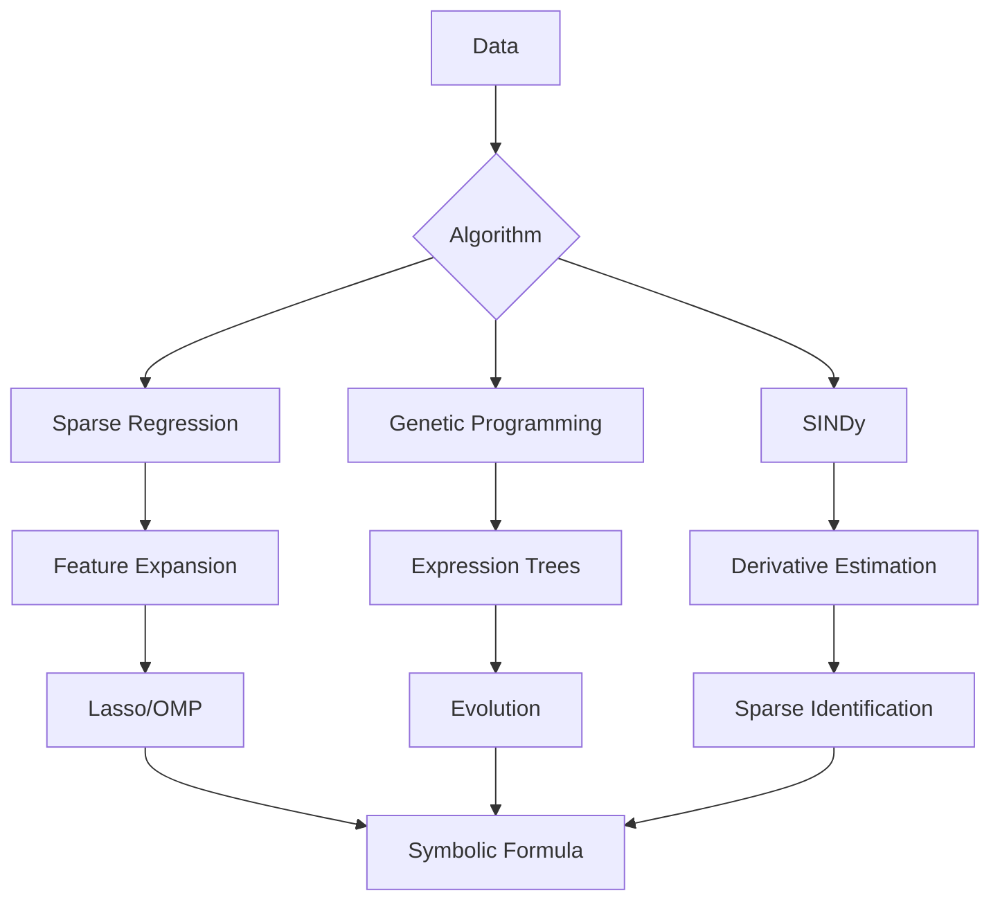

# Kalkulator-ai

<div align="center">


**Discover mathematical formulas from data. Like curve fitting, but it finds the actual equation.**

</div>

---

## What is Kalkulator?

Kalkulator is a simple **Symbolic Regression** engine capable of discovering mathematical formulas, physical laws, differential equations, and causal relationships from raw data.

It's also a "Computational Scientist" that can verify the laws of nature, discover ODEs from time series, and perform dimensional analysis.

What it can do is, you throw raw data to it, then you just say "find the pattern."

`>>> d(0)=0, d(1)=4.9033250000, d(2)=19.6133000000, d(3)=44.1299250000, find d(t)`

It looks at the data and asks: "Is this gravity?" (Polynomial) "Is this a population boom?" (Exponential) "Is this a sound wave?" (Trigonometric) "Is this a black hole?" (Inverse Square)

Kalkulator just did Galileo's life's work in 0.02 seconds.

`d(t) = 4.903325*t^2` The output

`>>> diff(4.903325*t^2)` Differentiate it

`diff(4.903325*t^2) = 9.80665*t` behold, the gravity of earth

---

## 🚀 Key Features

| Feature | Description |
|---------|-------------|
| **Symbolic Regression** | Discovers functions like `exp(-x)*sin(x)` or `100/d²` from raw data |
| **Agentic Discovery** | Pattern detectors guide feature selection - finds `log(1+exp(x))` not `1/(340-x)` |
| **Genetic Programming** | Evolves complex compositional functions beyond linear combinations |
| **ODE Discovery (SINDy)** | Discovers differential equations from time series data |
| **Causal Discovery** | Infers causal structure using the PC algorithm |
| **Dimensional Analysis** | Buckingham Pi theorem for finding dimensionless groups |
| **Robust Regression** | Handles noisy data with Huber, RANSAC, and bootstrap methods |
| **Physics-Aware** | Detects quadratic interactions (`m*v²`) and geometry (`π*r²*h`) |
| **Calculus Engine** | Differentiates (`diff`) and Integrates (`integrate`) symbolically |
| **Code Export** | Transpiles discovered math into Python code (`.py`) for production |
| **Function Persistence** | Save/Load custom functions to disk (`savefunction`, `loadfunction`) |
| **80 Feynman Benchmarks** | Test against physics equations from the Feynman Lectures |

---

## ⚡ Quick Start

### Installation

```bash
git clone https://github.com/sizzlins/kalkulator-ai
cd kalkulator-ai
pip install -r requirements.txt
```

### Run the Calculator

```bash
python kalkulator.py
```
### Or

Download the .EXE file (kalkulator.exe) and simply run it

---

## 🧪 Examples

Garbage in -> Garbage out
Make sure your data is accurate
The more accurate data you give, the more accurate the output is
If it is a float, the more accurate decimal places you give, the more accurate the output will be

### 1. Discovering Physics (Kinetic Energy)

```
>>> E(2, 4)=16, E(4, 2)=8, E(10, 1)=5, find E(m,v)
E(m, v) = 0.5*m*v^2
```

### 2. Gaussian / Bell Curve

```
>>> g(0)=1, g(1)=0.3679, g(2)=0.0183, find g(x)
g(x) = exp(-x^2)
```

### 3. Inverse Square Law

```
>>> I(1)=100, I(2)=25, I(4)=6.25, find I(d)
I(d) = 100*d^-2
```

### 4. Genetic Programming (Compositional Functions)

```
>>> evolve f(x) from x=[1,2,3,4,5], y=[2,5,10,17,26]
Evolving f(x) from 5 data points...
Discovered: f(x) = x^2 + 1
```

### 5. ODE Discovery (SINDy)

Discover the harmonic oscillator from position/velocity data:

```
>>> find ode from t=[0,0.1,0.2,...], x=[1,0.995,...], v=[0,-0.0998,...]
Discovering ODEs for ['x', 'v']...

Discovered equations:
dx/dt = v
dv/dt = -x
```

### 6. Causal Discovery

```
>>> discover causal graph from X=[...], Y=[...], Z=[...]
Causal Graph:
  Nodes: X, Y, Z
  Undirected edges:
    X -- Y
    Y -- Z
```

### 7. Dimensional Analysis (Buckingham Pi)

```
>>> find dimensionless from F=force, rho=density, v=velocity, L=length
Dimensionless groups (Buckingham Pi):
  Π1 = rho * v^2 * L^2 / F
```

### 8. Code Export

```
>>> V(1, 1)=3.1416, V(2, 1)=12.566, V(1, 2)=6.283, find V(r,h)
V(r, h) = 3.142*r^2*h

>>> export V to cylinder.py
Function 'V' exported to cylinder.py
```

### 9. Function Persistence

```
>>> f(x) = x^2 + 2*x + 1
Function 'f(x)' defined as: x**2 + 2*x + 1

>>> save
Saved 1 function(s).

>>> quit
...
(restart)
>>> loadfunction
Loaded 1 function(s).

>>> showfunction
User functions:
f(x)=x**2 + 2*x + 1

>>> clearfunction
Functions cleared from current session.

>>> clearsavefunction
Saved functions cleared.
```

---

## 🧠 How It Works

Kalkulator uses multiple algorithms for scientific discovery:



### Modules

| Module | Purpose |
|--------|---------|
| **symbolic_regression/** | Genetic programming with Pareto optimization |
| **noise_handling/** | Robust regression (Huber, RANSAC, IRLS) |
| **dynamics_discovery/** | SINDy for ODE discovery |
| **dimensional_analysis/** | SI units and Buckingham Pi theorem |
| **causal_discovery/** | PC algorithm for causal graphs |
| **benchmarks/** | 80 Feynman physics equations |

---

## 📁 Project Structure

```
kalkulator/
├── kalkulator_pkg/
│   ├── cli/                        # Interactive REPL (Package)
│   │   ├── app.py                  # Main application logic
│   │   ├── commands/               # Command handlers
│   │   ├── ...
│   ├── solver/                     # Solver engine (Package)
│   │   ├── dispatch.py             # Equation solver dispatch
│   │   ├── algebraic.py            # Algebraic solvers
│   │   ├── numeric.py              # Numeric solvers
│   │   ├── system.py               # System solver
│   │   ├── ...
│   ├── symbolic_regression/        # GP engine
│   │   ├── expression_tree.py
│   │   ├── operators.py
│   │   ├── pareto_front.py
│   │   └── genetic_engine.py
│   ├── noise_handling/             # Robust methods
│   │   ├── robust_regression.py
│   │   └── uncertainty.py
│   ├── dynamics_discovery/         # ODE discovery
│   │   ├── derivative_estimation.py
│   │   └── sindy.py
│   ├── dimensional_analysis/       # Units & Pi theorem
│   │   └── units.py
│   ├── causal_discovery/           # Causal inference
│   │   └── pc_algorithm.py
│   ├── benchmarks/                 # Feynman equations
│   │   ├── feynman_equations.py
│   │   └── benchmark_runner.py
│   └── ...
├── tests/
├── requirements.txt
└── README.md
```

---

## 🔧 Configuration

Environment variables for advanced tuning:

| Variable | Default | Description |
|----------|---------|-------------|
| `KALKULATOR_GP_POPULATION_SIZE` | 200 | GP population per island |
| `KALKULATOR_GP_GENERATIONS` | 50 | Max generations |
| `KALKULATOR_SINDY_THRESHOLD` | 0.1 | SINDy sparsity threshold |
| `KALKULATOR_CAUSAL_ALPHA` | 0.05 | CI test significance level |

---

## 🧪 Running Tests

```bash
python -m pytest tests/
```

Or run benchmarks:

```bash
>>> benchmark 10
Running benchmark on 10 Feynman equations...
Success rate: 80.0%
```

---

## Development

This project was architected and engineered by **Syahbana**. LLMs were utilized for rapid prototyping and boilerplate generation. All core logic was manually verified and tuned.

---

## License

MIT License - feel free to use this in your own projects!
