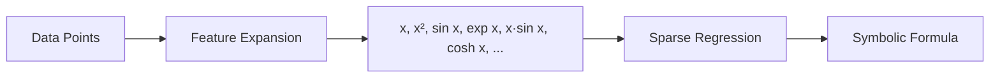

# Kalkulator: Symbolic Regression & Science Engine

<div align="center">


**Discover mathematical formulas from data. Like curve fitting, but it finds the actual equation.**

</div>

---

## What is Kalkulator?

Kalkulator is a **Symbolic Regression** engine capable of discovering mathematical formulas, physical laws, and geometric relationships from raw data.

Kalkulator is also a "Computational Scientist" that can verify the laws of nature

What it can do is, you throw raw, noisy chaos at it. You just say "find the pattern."

`>>> d(0)=0, d(1)=4.9033250000, d(2)=19.6133000000, d(3)=44.1299250000, find d(t)`


It looks at the data and asks: "Is this gravity?" (Polynomial)

"Is this a population boom?" (Exponential)

"Is this a sound wave?" (Trigonometric)

"Is this a black hole?" (Inverse Square)

You are the Director of Research. You collect the data, and the AI acts as your Senior Theorist, proposing the physical law that governs that universe.

When Galileo dropped balls from the Leaning Tower of Pisa, he didn't have a formula. He just had timestamps and distances. He had to spend years analyzing that data to realize d ∝ t².

Kalkulator just did Galileo's life's work in 0.02 seconds. That is the difference, one answers questions; the other discovers truth.
`d(t) = 4.903325*t^2`

`>>> diff(diff(d(t), t), t)`

`diff(diff(d(t), t), t) = 9.80665*t` The gravity of earth.

Unlike standard curve fitting which gives you coefficients, Kalkulator identifies the **underlying symbolic structure**:

| Input Data | Standard Fitting | **Kalkulator** |
|------------|------------------|----------------|
| `(1,1), (2,4), (3,9)` | `y = 1.0x²` | `f(x) = x²` |
| `(1,100), (2,25), (4,6.25)` | `y = 100/x²` | `I(d) = 100*d⁻²` |
| `g(0)=1, g(1)=0.37, g(2)=0.02` | Polynomial approximation | `g(x) = exp(-x²)` |

It also functions as a full **CLI Computer Algebra System** with Calculus, Algebra, and Code Generation.

---

## 🚀 Key Features

| Feature | Description |
|---------|-------------|
| **Symbolic Regression** | Discovers functions like `exp(-x)*sin(x)` or `100/d²` from raw data |
| **Physics Aware** | Detects quadratic interactions (`m*v²`) and geometry (`π*r²*h`) |
| **Calculus Engine** | Differentiates (`diff`) and Integrates (`integrate`) symbolically |
| **Code Export** | Transpiles discovered math into Python code (`.py`) for production |
| **Robustness** | Handles contradictory data, ghost variables, and scale invariance |

---

## ⚡ Quick Start

### Installation

```bash
git clone https://github.com/sizzlins/kalkulator-ai
cd kalkulator-ai
pip install -r requirements.txt
```

### Run the CLI

```bash
python -m kalkulator_pkg.cli
```

---

## 🧪 Examples

### 1. Discovering Physics (Kinetic Energy)

Feed raw mass and velocity data to find the energy law:

```
>>> E(2, 4)=16, E(4, 2)=8, E(10, 1)=5, find E(m,v)
E(m, v) = 0.5*m*v^2
```

### 2. Gaussian / Bell Curve

Discover the normal distribution from sample points:

```
>>> g(0)=1, g(1)=0.3679, g(2)=0.0183, g(3)=0.0001, find g(x)
g(x) = exp(-x^2)
```

### 3. Inverse Square Law (Light Intensity)

Find the physics of light intensity vs distance:

```
>>> I(1)=100, I(2)=25, I(4)=6.25, I(5)=4, find I(d)
I(d) = 100*d^-2
```

### 4. Geometry & Code Generation

Find the volume of a cylinder and export to Python:

```
>>> V(1, 1)=3.1416, V(2, 1)=12.566, V(1, 2)=6.283, find V(r,h)
V(r, h) = 3.142*r^2*h

>>> export V to cylinder.py
Function 'V' exported to cylinder.py
```

**Generated `cylinder.py`:**
```python
import math

def V(r, h):
    """Auto-generated by Kalkulator AI
    Equation: 3.142*r^2*h
    """
    return 3.142*r**2*h
```

### 5. Calculus

Differentiate discovered or user-defined functions:

```
>>> f(x) = x*sin(x)
>>> diff(f(x), x)
x*cos(x) + sin(x)
```

---

## 🧠 How It Works

Kalkulator uses **Sparse Regression (Lasso)** on a dynamically generated feature matrix:



1. **Feature Expansion**: Generates candidate terms - polynomials (`x²`), transcendentals (`sin x`, `exp x`, `log x`), and interactions (`x·y²`)
2. **Regularization**: Uses a hybrid penalty system to suppress complex terms unless they significantly improve accuracy
3. **Ambiguity Resolution**: Uses Occam's Razor to choose the simplest valid mathematical explanation

### Supported Features

| Category | Features |
|----------|----------|
| Polynomials | `x`, `x²`, `x³`, `x*y`, `x²*y`, `x*y²` |
| Trigonometric | `sin(x)`, `cos(x)`, `sin(2x)`, `cos(2x)` |
| Exponential | `exp(x)`, `exp(-x)`, `exp(-x²)` |
| Hyperbolic | `sinh(x)`, `cosh(x)` |
| Logarithmic | `log(x)`, `x*log(x)` |
| Damped Oscillation | `exp(-x)*sin(x)`, `exp(-x)*cos(x)` |
| Growing Waves | `x*sin(x)`, `x*cos(x)` |
| Rational | `1/x`, `1/x²` |

---

## 🛠️ Tech Stack

- **Python 3.10+**
- **SymPy** - Computer Algebra System
- **Scikit-Learn** - Sparse Regression (Lasso)
- **NumPy** - Vectorized Operations

---

## 📁 Project Structure

```
kalkulator/
├── kalkulator_pkg/
│   ├── __init__.py
│   ├── cli.py                    # Interactive REPL
│   ├── parser.py                 # Expression parsing
│   ├── solver.py                 # Equation solving
│   ├── function_manager.py       # Function storage & finding
│   ├── function_finder_advanced.py  # Feature generation & Lasso
│   ├── worker.py                 # Safe evaluation
│   └── config.py                 # Configuration
├── tests/
│   └── test_*.py                 # Unit tests
├── requirements.txt
├── README.md
└── .gitignore
```

---

## 🧪 Running Tests

```bash
python -m pytest tests/
```

Or run the comprehensive feature test:

```bash
python test_all_features.py
```

---

## Development

This project was architected and engineered by **Syahbana**. Large Language Models (LLMs) were utilized for rapid prototyping, code generation of boilerplate components, and refactoring assistance. All core logic regarding feature engineering, regularization strategies, and calculus integration was manually verified and tuned.

---

## License

MIT License - feel free to use this in your own projects!
